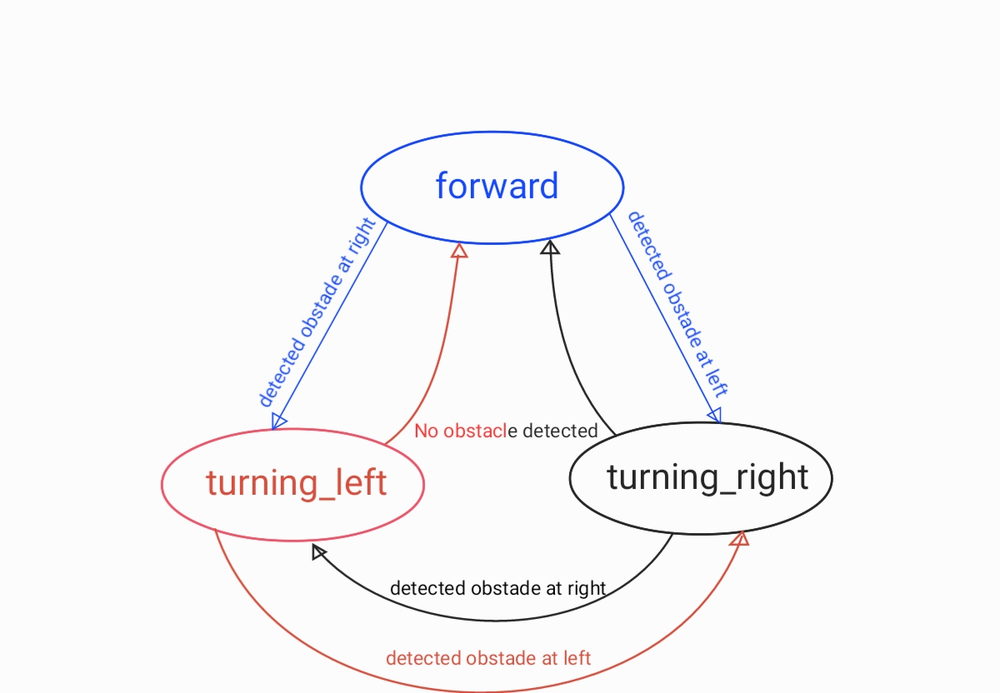
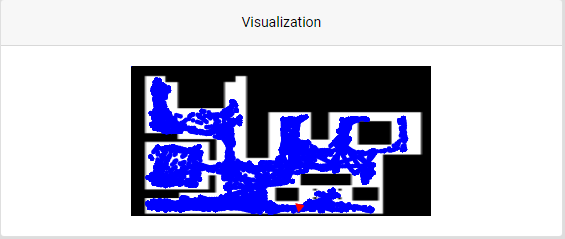
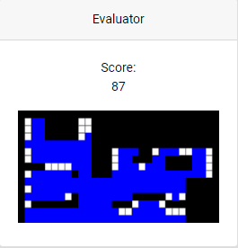

# Vacuum cleaner

La primera práctica consiste en desarrollar un programa que evite que el robot se choque con los obstáculos y recorra la mayor cantidad posible del espacio en un entorno
simulado en Gazebo.

Para lograr esto se hará uso de las medidas del láser.

## Implementaciones

### 1. Choca-gira simple
Existen varias formas de resolver este problema, siendo la más sencilla un choca-gira, el cual, al detectar un objeto, hará que el robot gire en una dirección predeterminada y continúe hasta el siguiente obstáculo.

Sin embargo, esta implementación cuenta con el problema de tener patrones fijos de movimiento, por lo tanto, en caso de quedar encerrado en una habitación, por ejemplo, el robot será incapaz de salir ya que repetirá el mismo camino todo el rato.
Por otro lado, la cantidad de espacio recorrida será similar en cada intento y será poco probable que limpie correctamente areas amplias con pocos obstáculos, y además, cabe la posibilidad de girar hacia el obstáculo, teniendo que dar una vuelta completa y haciendo que el robot tarde más en ejecutar la tarea.

### 2. Choca-gira avanzado
En esta implementación, se mide la dirección en la que ha sido detectado el objeto y hace que el robot gire en dirección opuesta, por lo tanto el giro es más eficiente, pero esto no soluciona el problema de la repetición de patrones.

### 3. Choca-gira aleatorio
Esta es la implementación usada, aunque añadiendo un movimiento circular para más aleatoriedad. 
De esta forma, el robot girará evitando el obstáculo durante un tiempo aleatorio usando la librería _random_ de python. Además, el robot no avanza de forma lineal, sino que se desvía hacia la izquierda para que los caminos recorran la mayor cantidad de espacio posible.

Para ocasiones en las que el láser no detecte objetos, por encontrarse a menor altura que este, también se hace uso del bumper.

### Otras implementaciones
Otras formas de implementar el código podrían ser haciendo que el robot forme una espiral u otros patrones cada cierta cantidad de tiempo. Sin embargo, para esta práctica la aleatoriedad ha dado buen resultado como comprobaremos más adelante por lo que no he visto necesario implementar estos patrones.

## Máquina de estados
A continuacion, veremos la máquina de estados implementada. Como podréis observar es muy simple y solo consta de 3 estados que se van alternando según si detecta un obstáculo y el lado en el que lo detecta.

## Rendimiento de la implementación
Como veremos a continuación, la implementación usada ha dado un buen rendimiento, llegando a casi todas las zonas del escenario en alrededor de 1h.

Esta implementación ha obtenido una puntuación de 87, como podemos ver aquí

## Video
Por último os muestro un video de los primeros minutos de ejecución del código.
El video trata de alrededor de 5min de ejecución a cámara rápida para que podáis observar el comportamiento del robot.

_En algunas partes puede verse al robot saltar de una posición a otra, esto se debe a la mala conexión a internet._

[Video del funcionamiento](https://drive.google.com/file/d/1ntEG9PLQ5Jy8CvPsx3WR6oiTrp91ERsP/view?usp=sharing)

[Vuelve al blog](./)
