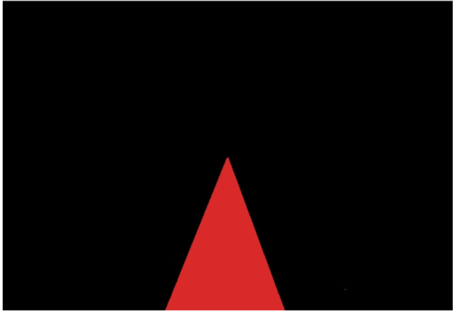
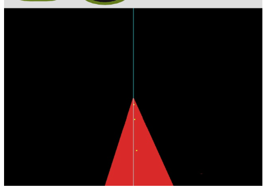
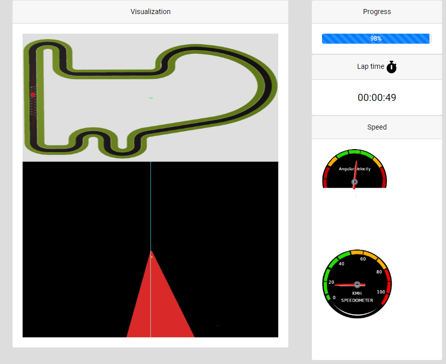

# Follow Line

## Introducción
El objetivo de esta prácitca es aprender a programar y manejar controladores para mejorar la respuesta de un sistema, reduciendo el error y evitando producir
oscilaciones o respuestas lentas.

## Ideas principales
Los objetivos principales de esta práctica son aprender a usar filtros de color y a controlar los sistemas usando un PID.

## Filtro de color
Para el filtro de color lo más sencillo es usar la libreria de python de OpenCV y crear una máscara con los límites del color que queramos, en mi caso con un límite inferior de ``` [(17, 15, 100)] ``` y un límite superior de ``` [(52, 56, 255)] ``` para el color rojo, el resultado ha sido muy bueno.

Una vez definidos los límites solo hay que aplicarlos a la imagen y quedará algo como esto:



## PID
Una vez filtrada la linea, debemos escoger los puntos de referencia que tomaremos.

Estos puntos de referencia nos servirán para tener una estimación de cuánto error hay y así poder usar el PID para arreglarlo y centrar el coche de forma progresiva, 
haciendo el movimiento mucho más fluído.

Para esta práctica he pensado en 3 puntos distintos de referencia, a distintas distancias del coche.



Los tres puntos corresponden al punto medio de la linea roja y la linea vertical azul corresponde con la mitad de la pantalla.

Para diseñar el PID, usamos los puntos de referencia y calculamos como de lejos están de la mitad de la pantalla, ya que cuando el coche vaya recto, estos deberían 
coincidir.

A este error obtenido le aplicamos distintas operaciones según el tipo de controlador.

En este caso, al ser un PID, significa que contiene parte proporcional, derivativa e integral.

Por lo tanto, deberemos sumar cada una de las partes:

  1. Proporcional: error * Kp (ganancia proporcional)
  1. Derivativa: (error<sub>t</sub> - error<sub>t-1</sub>) * Kd (ganancia derivativa)
  1. Integral: Σerror<sub>i</sub> * Ki (ganancia integral)

Kp, Kd y Ki son constantes que tendremos que probar a cambiar sus valores hasta obtener el resultado esperado

Una vez obtenido el valor del PID, definimos un valor máximo de la velocidad, y un valor máximo arbitrario del PID para hacer una regla de tres y escalarlo a 
la velocidad angular.

Con valores de Kp = 0.5, Kd = 0.8 y Ki = 0.001, y con una velocidad lineal máxima de 15 y una velocidad angular máxima de 10, y 480 muestras, el coche ha conseguido completar el circuito base en 49 segundos.

Aquí una foto ya que desafortunadamente no pude grabar un vídeo:



Esta ya es una buena marca.

Sin embargo, ¿Podría hacerlo más rápido?

Cabe destacar que otra información que falta es entre cuanto tenemos que dividir la escala de la velocidad. A mayor número, más cantidad de muestras y por tanto, más precisión.

Por lo tanto al poner el número de muestras en 5000, deberemos subir bastante las ganancias, pero obtendremos una mayor precisión con los valores correctos.

Tras numerosas pruebas, he conseguido un comportamiento muy estable con un tiempo de vuelta de unos 50 segundos.

Los valores usados son:
- Kp = 2.7
- Kd = 6.2
- Ki = 0.19
- Velocidad lineal máxima = 15
- Velocidad angular máxima = 15 (en ambos sentidos)
- Numero de muestras = 5000

Aquí un vídeo completando el primer circuito:

<div style="position: relative; padding-bottom: 56.25%; height: 0;"><iframe src="https://jumpshare.com/embed/mhceLB5J6H6GBezDznAa" frameborder="0" webkitallowfullscreen mozallowfullscreen allowfullscreen style="position: absolute; top: 0; left: 0; width: 100%; height: 100%;"></iframe></div>

Y aquí un video completando el de Montmelo:

<div style="position: relative; padding-bottom: 56.25%; height: 0;"><iframe src="https://jumpshare.com/embed/XvUla9zqjSmBhBQLCafW" frameborder="0" webkitallowfullscreen mozallowfullscreen allowfullscreen style="position: absolute; top: 0; left: 0; width: 100%; height: 100%;"></iframe></div>

Cabe destacar que en ambos videos el simulador no iba muy bien por lo que pueden haber tirones, sin embargo los videos están sin modificar. 

[Vuelve al blog](../)
