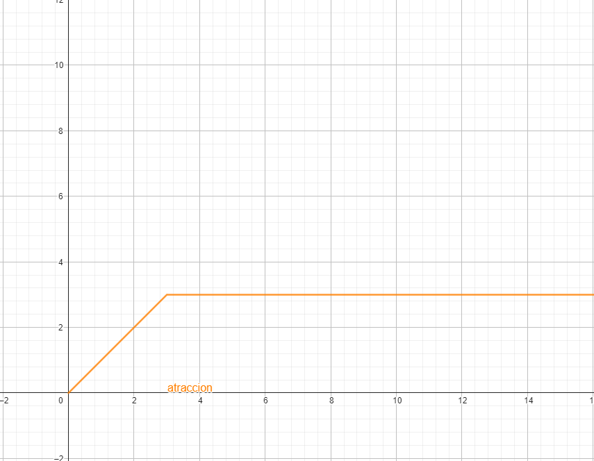
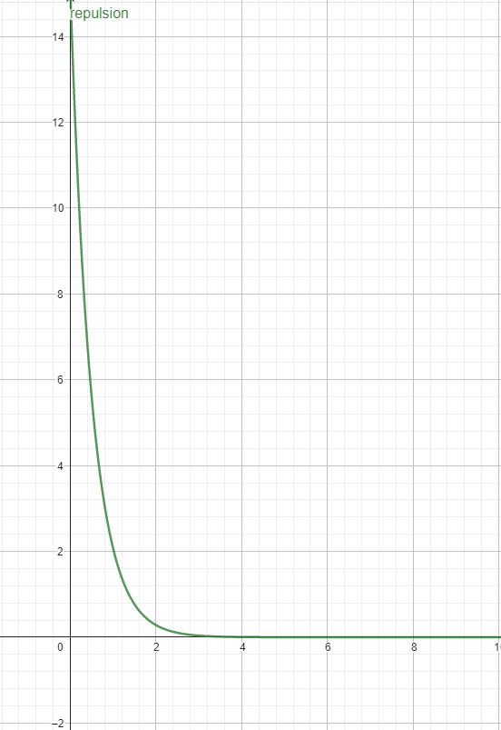

# Obstacle Avoidance

## Introducción
El objetivo de esta prácitca es aprender a programar un coche de carreras capaz de navegar y esquivar obstáculos con el método VFF (Virtual Force Field).

## Ideas principales
El método VFF consiste en crear un campo con las fuerzas de atracción y repulsión que generan el objetivo y los obstáculos respectivamente y obtener
la fuerza resultante que será la que mueva el coche, permitiendo seguir el objetivo y evitar obstáculos.

## Metodología
El método VFF se sirve principalmente de 3 elementos:
  - [ ]  Vector de atracción
  - [ ]  Vector de repulsión
  - [ ]  Relación entre repulsión y atracción
 
La correcta implementación de los 3 elementos dará un comportamiento deseable, sin embargo, implementarlos correctamente y conseguir un 
comportamiento robusto ha sido complicado.

## Vector de atracción
En un primer momento puede parecer un problema sencillo, y en parte es el menos complicado de los 3, aunque sí hay que tener un par de cosas en cuenta.

Lo primero es que obtener las coordenadas del objetivo respecto al coche no es suficiente, ya que con un objetivo muy lejano la atracción será demasiado grande y puede provocar comporamientos no deseados.

Por lo tanto el primer paso es acotar el módulo del objetivo para que no sobrepase cierto umbral, este umbral dependerá de cada implementación y en mi caso coincide con la velocidad máxima que quiero que alcanze el vehículo. Esto es porque al obtener las componentes con el nuevo vector acotado, en los casos extremos, la atracción no sobrepasará la velocidad máxima.

El comportamiento de este vector será el de una función lineal acotada como esta:

Teniendo esto en cuenta, solo resta un problema:

El caso en el que el objetivo está detrás del coche. En este caso, calcular el ángulo puede ser un problema. 
La solución a la que he llegado ha sido que al sobrepasar el objetivo, cambio el signo de las componentes para que la resultante apunte correctamente.

Con esto el vector de atracción está implementado.
  - [x]  Vector de atracción
  - [ ]  Vector de repulsión
  - [ ]  Relación entre repulsión y atracción

## Vector de repulsión
Este elemento fue el que más me costó entender para obtener una buena forma de implementarlo, sobretodo debido a pensar de forma errónea cómo funciona.

Lo primero fue entender que la media de las lecturas devuelve el sitio con menos obstáculos (ya que las medidas serán mayores por no tener un objeto cerca, y por lo tanto tendrán más peso en la media), en ese momento ví que realmente lo que buscaba era lo contrario, que los obstáculos tuvieran más peso para, al obtener la media, tener el vector de repulsión.

Para esta tarea creé una función similar a $$15 \over e^{2x}$$ con la cual daba más importancia a las medidas pequeñas que a las grandes, y a la hora de hacer la media, destacarían más los obstáculos.

Ya solo resta obtener las componentes de las medidas con la función aplicada y hacer la media de estas.

El resultado es el vector de repulsión.

  - [x]  Vector de atracción
  - [x]  Vector de repulsión
  - [ ]  Relación entre repulsión y atracción

## Relación entre repulsión y atracción
Esta parte se basa en prueba y error.

Una vez hemos conseguido implementar de forma confiable los vectores de repulsión y de atracción, encontrar la realción adecuada entre ellos es un proceso de prueba y error, multiplicando ambos vectores por una variable y comprobando el comportamiento de la suma de ambos vectores multiplicados.

En mi caso, con una relación 1 / 1 tenía un comportamiento muy robusto excepto con un coche justo en frente, que no giraba lo suficiente y lo rozaba.

Por lo tanto la solución fue aumentar la variable del vector de repulsión para darle más peso en el vector resultante.

Al final, la relación entre vector atracción / vector repulsión fue de 1 / 1.5.

Por último, hemos encontrado la relación, y con esto, hemos terminado el código.

  - [x]  Vector de atracción
  - [x]  Vector de repulsión
  - [x]  Relación entre repulsión y atracción
  
## Video demostración
Aquí un video de una vuelta completa:

<iframe src="https://jumpshare.com/embed/2gM87xp2QD8XbF4teDkA" frameborder="0" webkitallowfullscreen mozallowfullscreen allowfullscreen style="position: absolute; top: 0; left: 0; width: 100%; height: 100%;"></iframe>

El video está a x2, en él se ve que ha tardado unos 4min en completar el circuito.

[Vuelve al blog](../)
