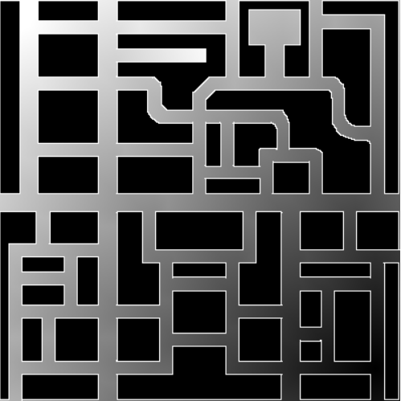

# Global Navigation

## Introducción
Esta práctica consiste en implementar un código capaz de recibir un punto en el mapa, planificar el camino más corto hasta este y navegar hacia él.
Para esto usamos un algoritmo de path planning llamado GPP (Gradient Path Planning), este algoritmo hace uso de una rejilla cuyo coste de cada celda aumenta según se aleja del objetivo, aplicando un mayor coste a aquellas celdas cercanas a las paredes.

Para navegar he utilizado VFF, reutilizando el programa de la práctica anterior, Obstacle Avoidance, para dirigir el coche a través de un vector de atracción, sin hacer uso de la repulsión.

## Ideas principales
Este código puede dividirse en dos partes:
- [ ] Path planning.
- [ ] Path navigation.

Cada uno con sus subsecuentes problemas, que más adelante veremos y solucionaremos.

En path planning tenemos cuatro partes:
- [ ] Rejilla simple
- [ ] Rejilla normalizada
- [ ] Rejilla con advertencia de obstáculos
- [ ] Buscar el camino

## Metodología
Primero abordaremos el path planning:

### Path Planning
Como ya hemos dicho, el algoritmo de path planning por gradiente, hace uso de una rejilla a la que se le asigna un peso en cada celda dependiendo de la distancia al objetivo.

El algoritmo detrás de esto es relativamente simple, pero hacerlo eficiente es más complicado.

#### Generar gradiente
Para generar el gradiente simple, basta con empezar desde la posición del objetivo, comprobar si es un obstáculo o la meta, en este caso la posición del coche, y comprobar que no se ha visitado ya ese nodo, tras esto se obtienen las celdas adyacentes y, si no se han visitado, se guardan para comprobarlas. El algoritmo termina cuando no hay más celdas por comprobar o se ha llegado a la meta.

Para hacer este algoritmo más eficiente, para comprobar que no he visitado el nodo, compruebo que el valor de la rejilla en esa posición sea cero, ya que la rejilla originalmente esta rellena de ceros. Por lo que si en esa posición tiene otro valor, ya he visitado esa rejilla.

Otra forma que implementé es guardar cada rejilla visitada en una lista, sin embargo, con distancias largas este método se vuelve muy lento y poco eficiente.

Además, la rejilla no para en el coche, sino que avanza unas cuantas posiciones más para evitar problemas por tener valores de cero en las celdas cercanas al coche.

- [x] Rejilla simple
- [ ] Rejilla normalizada
- [ ] Rejilla con advertencia de obstáculos
- [ ] Buscar el camino

Una vez obtenida la rejilla simple, normalizar sus valores es fácil, sabiendo el valor que tiene la rejilla en la posición del coche, el cual será el valor máximo, hacemos una proporción dividiendo el valor máximo de la escala de grises, 255 entre el coste de la rejilla donde se encuentra el coche. Al multiplicar cada posición que no sea un obstáculo por esta proporción, la rejilla queda normalizada.

- [x] Rejilla simple
- [x] Rejilla normalizada
- [ ] Rejilla con advertencia de obstáculos
- [ ] Buscar el camino

Por último, la advertencia de obstáculos, esto se refiere a asignar más peso a las celdas cercanas a obstáculos para evitar que a la hora de buscar el camino, este se acerce demasiado a las paredes.

Para hacer esto he implementado un algoritmo muy similar al de la rejilla simple, con la diferencia de que en vez de pasar por todos los nodos, solo visito aquellos que son obstáculos, los cuales he guardado en una lista mientras hacía la rejilla simple. Por cada celda visitada, guardo en otra lista las celdas vecinas que no sean obstáculos ni hayan sido ya visitadas. De esta forma al revisar la lista original, se crea otra lista con el siguiente nivel de profundidad. Solo hace falta repetir esto el mismo número de veces que casillas de profundidad queramos.

De nuevo, para comprobar si ya se ha vistado una celda, basta con comprobar si el valor de la rejilla sin modificar y el de la modificada en esa posición coinciden, si no lo hacen, esa celda ya está normalizada.

A su vez, en vez de aplicar más coste solo a las celdas adyacente a los obstáculos, aplico coste también a las adyacentes de estas y así hasta el número de profundidad que elija. El peso aplicado también depende de la profunidad elegida y del peso que tendrán las celdas más cercanas al obstáculo, de forma que cuanto más te alejas del obstáculo menor coste se le suma a esa posición.

La fórmula usada para sacar estos costes es la siguiente:
peso = peso máximo - (número de profundidad (siendo 0 las celdas más cercanas al obstáculo) * (peso máximo / profundidad deseada))

De esta forma, con una profunidad de 5 y un peso máximo de 50, a las celdas al lado del obstáculo se les sumará 50 al coste inicial y a las que estén 4 posiciones alejadas de los obstáculos se les sumará 10 al coste inicial que tuvieran.

- [x] Rejilla simple
- [x] Rejilla normalizada
- [x] Rejilla con advertencia de obstáculos
- [ ] Buscar el camino

#### Buscar camino
Teniendo ya la rejilla completada, buscar el camino ser resume en, empezando por la posición del coche, buscar las celdas adyacentes, horizontales o verticales, con menor coste hasta llegar al objetivo o lo más cercano a este posible.

Para alijerar el cómputo del algoritmo, en vez de guardar todas las celdas ya visitadas, guardo las últimas 20, evitando así caer en un bucle.

Además, pueden haber ocasiones en las que llegar al objetivo sea complicado y se creen mínimos locales fruto de modificar la rejilla con los valores de cercanía a las paredes. Por esto, es importante detectar los mínimos locales y saber qué hacer en cada caso.

En mi caso, al detectar un mínimo local, compruebo la distancia manhattan al objetivo, si está aún muy lejos, avanzo a la siguiente celda con menor coste, si está suficientemente cerca, finalizo la búsqueda.

- [x] Rejilla simple
- [x] Rejilla normalizada
- [x] Rejilla con advertencia de obstáculos
- [x] Buscar el camino

- [x] Path planning.
- [ ] Path navigation.

### Path Navigation
Como ya he dicho antes, para navegar hasta el objetivo he usado la implementación de VFF de la práctica obstacle avoidance con algunas modificaciones:

Lo primero es que no hago uso del vector repulsión, ya que el camino está buscado de forma que evite obstáculos, no es necesario.

Lo segundo es que al estar trabajando en una rejilla, he necesitado pasar las coordenadas a coordenadas del mundo, esto no ha sido complicado ya que, sabiendo que una rejilla es un cuadrado de 1.25m de ancho y largo en el mundo simulado, y que las coordenadas del mundo simulado varían entre -250 y 250, solo es necesario multiplicar la posición de la celda por 1.25 y restarle 250, ya que el origen está en el centro del mundo. 

Habiendo aplicado esto, solo resta obtener los goals locales, en mi caso en las posiciones que componen el camino, una cada 10. Para evitar que los goals locales estén demasiado cerca entre sí, pero que funcione correctamente en esquinas.

A la hora de implementar esto hay que tener en cuenta que la coordenada (x, y) en el mundo es la coordenada (y, x) en el mapa, además de comprobar bien el sistema de referencia.

Una vez conseguido arreglar todos los problemas, el programa está terminado.

- [x] Path planning.
- [x] Path navigation.

## Video demostración
Aquí un video del taxi yendo a una localización y luego a otra muy lejana:

<iframe src="https://jumpshare.com/embed/qt3qPhXz0eE01z4WGefs" frameborder="0" webkitallowfullscreen mozallowfullscreen allowfullscreen style="position: absolute; top: 0; left: 0; width: 100%; height: 100%;"></iframe>

[Vuelve al blog](../)

